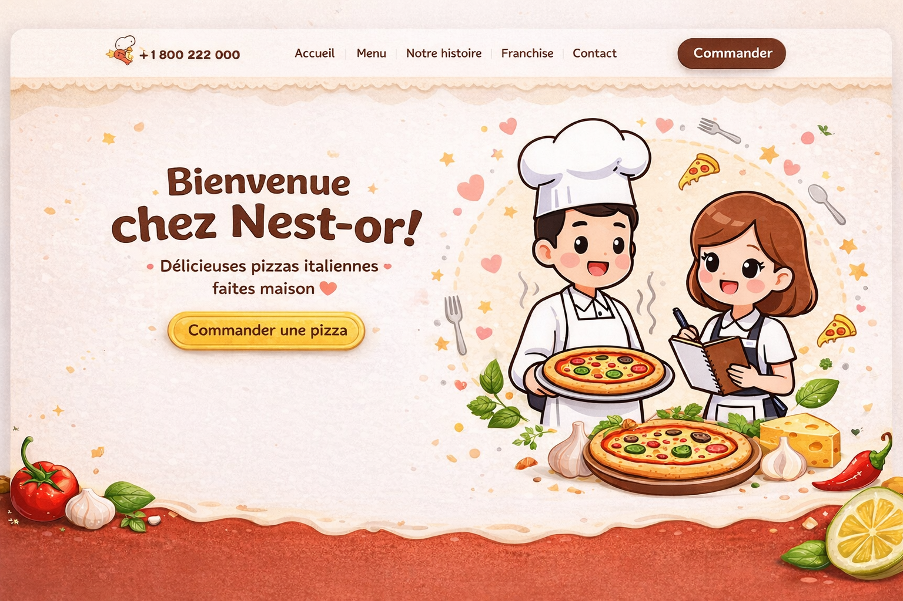

# 🍕 Nest-or - Pizzeria Italienne

Application web complète de commande en ligne pour pizzeria, avec un design premium inspiré de Deliveroo et Uber Eats.



## 📸 Aperçu

- **Design moderne** avec hero section personnalisée
- **UI premium** style Deliveroo/Uber Eats
- **Panier avec drawer** fluide et animé
- **Responsive** mobile-first
- **Connexion API** temps réel

## 🏗 Architecture

```
NestOrProject/
├── nestor-app/      # Backend NestJS (API REST)
│   ├── src/
│   │   ├── pizzas/
│   │   ├── drinks/
│   │   ├── desserts/
│   │   └── orders/
│   └── Port: 3001
│
└── nestor-front/    # Frontend Next.js 15
    ├── app/         # Pages (App Router)
    ├── components/  # Composants React
    ├── contexts/    # Context API (panier)
    ├── lib/         # Fonctions utilitaires
    └── Port: 3000
```

## 🚀 Démarrage Rapide

### Installation

```bash
# Backend
cd nestor-app
npm install

# Frontend
cd nestor-front
npm install
```

### Démarrage

**Terminal 1 - Backend**
```bash
cd nestor-app
npm run start:dev
```
→ API disponible sur http://localhost:3001

**Terminal 2 - Frontend**
```bash
cd nestor-front
npm run dev
```
→ Application disponible sur http://localhost:3000

## ✨ Fonctionnalités

### Frontend (Next.js 15)

- ✅ **Hero Section** avec image personnalisée et animations
- ✅ **Catalogue de produits** 
  - Pizzas avec ingrédients
  - Boissons (avec/sans alcool)
  - Desserts
- ✅ **Panier intelligent**
  - Drawer coulissant
  - Ajout/Suppression de produits
  - Gestion des quantités
  - Calcul automatique du total
  - Persistance localStorage
- ✅ **Header sticky** avec compteur de panier en temps réel
- ✅ **Design responsive** optimisé mobile
- ✅ **Animations fluides** et transitions
- ✅ **Images dynamiques** avec Unsplash

### Backend (NestJS)

- ✅ **API REST complète**
- ✅ **CRUD pour tous les produits** (pizzas, boissons, desserts)
- ✅ **Gestion des commandes**
- ✅ **Validation des données** (class-validator)
- ✅ **CORS configuré** pour le frontend
- ✅ **Recherche et filtres** (pizzas par prix/ingrédients)

### 🔍 API Explorer

- ✅ **Interface interactive** pour explorer tous les endpoints
- ✅ **Test en un clic** de chaque endpoint
- ✅ **Visualisation des réponses** en temps réel
- ✅ **Copie des commandes cURL** pour documentation
- ✅ **25 endpoints** documentés et testables
- ✅ **Accessible via** http://localhost:3000/api-explorer

📖 Documentation complète : [API_EXPLORER_GUIDE.md](./API_EXPLORER_GUIDE.md)

### 🎛️ Panel d'Administration

- ✅ **Interface CRUD complète** pour gérer toutes les ressources
- ✅ **Gestion des pizzas** : Créer, modifier, supprimer
- ✅ **Gestion des boissons** : CRUD + disponibilité
- ✅ **Gestion des desserts** : CRUD + stock
- ✅ **Gestion des commandes** : Voir, traiter, supprimer
- ✅ **Interface moderne** avec design responsive
- ✅ **Accessible via** http://localhost:3000/admin

📖 Documentation complète : [ADMIN_PANEL_DOCUMENTATION.md](./ADMIN_PANEL_DOCUMENTATION.md)

## 🎨 Design System

### Palette de Couleurs

| Couleur | Hex | Usage |
|---------|-----|-------|
| Rouge primaire | `#c72027` | CTA, pizzas, branding |
| Rouge foncé | `#a01a20` | Hover states |
| Jaune | `#fef08a` | Accents, badges |
| Bleu | `#2563eb` | Boissons |
| Rose | `#db2777` | Desserts |

### Composants

- **Cards** : Ombres douces, hover avec scale
- **Buttons** : Rounded, transitions 300ms
- **Drawer** : Slide-in avec overlay
- **Badges** : Rounded-full avec icônes

## 📦 Technologies

### Frontend
- **Framework** : Next.js 15 (App Router)
- **Language** : TypeScript
- **Styling** : Tailwind CSS
- **Icons** : Lucide React
- **State** : React Context API
- **Images** : Next/Image + Unsplash

### Backend
- **Framework** : NestJS
- **Language** : TypeScript
- **Validation** : class-validator
- **API** : REST

## 📡 API Endpoints

### Pizzas
- `GET /pizzas` - Liste toutes les pizzas
- `GET /pizzas/search?maxPrice=12&ingredient=mozzarella` - Recherche

### Boissons
- `GET /drinks` - Liste toutes les boissons
- `GET /drinks/:id` - Détails d'une boisson
- `POST /drinks` - Créer une boisson
- `PUT /drinks/:id` - Modifier
- `DELETE /drinks/:id` - Supprimer

### Desserts
- `GET /desserts` - Liste tous les desserts
- `GET /desserts/:id` - Détails d'un dessert

### Commandes
- `GET /orders` - Liste des commandes
- `GET /orders?processed=true` - Commandes traitées
- `GET /orders/:id` - Détails d'une commande
- `POST /orders` - Créer une commande
- `PUT /orders/:id` - Modifier
- `DELETE /orders/:id` - Supprimer
- `PATCH /orders/:id/processed` - Marquer comme traitée

## 🔧 Configuration

### Frontend `.env.local`
```env
NEXT_PUBLIC_API_URL=http://localhost:3001
```

### Backend
Port par défaut : 3001 (configurable dans `main.ts`)

## 📱 Pages disponibles

### Frontend Routes

| Route | Description | Fonctionnalités |
|-------|-------------|-----------------|
| `/` | Page d'accueil | Hero section + Promotion menu |
| `/menu` | Catalogue complet | Recherche, filtres, tous les produits |
| `/checkout` | Commande | Formulaire livraison + récapitulatif |
| `/admin` | **NOUVEAU** Panel d'administration | CRUD complet pour toutes les ressources |
| `/api-explorer` | Explorateur API | Test des 25 endpoints en temps réel |

### Navigation

```
Header (sticky)
├── Menu (gauche)
│   ├── Lien vers /menu
│   ├── Bouton Admin (/admin) 🆕
│   ├── Bouton API (/api-explorer)
│   └── Téléphone (+ 1 800 222 000)
├── Logo (centre) → /
└── Panier (droite)
    └── Ouvre le drawer de commande
```

## 📱 Utilisation

### Commande client

1. **Parcourir** le menu (pizzas, boissons, desserts)
2. **Personnaliser** les pizzas (ajouter/retirer ingrédients)
3. **Cliquer** sur "Ajouter au panier" pour chaque produit
4. **Ouvrir** le panier via l'icône en haut à droite
5. **Modifier** les quantités avec +/-
6. **Bénéficier** de la réduction menu (10% si 1 pizza + 1 boisson sans alcool + 1 dessert)
7. **Commander** via le bouton "Commander maintenant"
8. **Remplir** le formulaire de livraison
9. **Confirmer** et recevoir le numéro de commande

### Test de l'API

1. **Accéder** à http://localhost:3000/api-explorer
2. **Choisir** une catégorie (Pizzas, Drinks, Desserts, Orders, Menu)
3. **Sélectionner** un endpoint
4. **Cliquer** sur "Tester" pour exécuter
5. **Consulter** les résultats en temps réel
6. **Copier** les commandes cURL pour documentation

## 🐛 Dépannage

### Les produits ne chargent pas
- Vérifier que le backend tourne sur le port 3001
- Vérifier `.env.local` dans le frontend
- Ouvrir la console du navigateur

### Erreurs CORS
- Vérifier que `app.enableCors()` est activé dans `nestor-app/src/main.ts`
- Vérifier l'URL origin : `http://localhost:3000`

### Le panier ne se sauvegarde pas
- Le navigateur doit autoriser localStorage
- Ne pas utiliser la navigation privée

## 📝 Roadmap

- [ ] Page de checkout avec formulaire
- [ ] Intégration paiement (Stripe)
- [ ] Confirmation de commande par email
- [ ] Authentification utilisateur (JWT)
- [ ] Historique des commandes
- [ ] Suivi de livraison en temps réel
- [ ] Système de notation/avis
- [ ] Programme de fidélité
- [ ] Tests unitaires et e2e

## 🤝 Contribution

Projet créé pour **Nest-or** - Pizzeria Italienne Authentique

### Développement
```bash
# Linter
npm run lint

# Build
npm run build

# Production
npm run start
```

## 📄 Licence

© 2026 Nest-or - Tous droits réservés

---

**Bon appétit !** 🍕❤️
